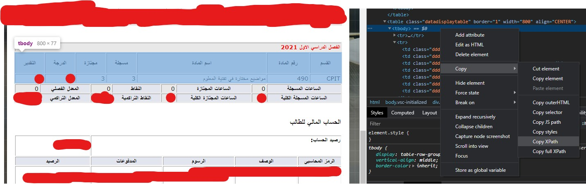

# OdusPlus Grade Checker

## Description

The OdusPlus Grade Checker is a Python script that automates the process of checking for new grades on the OdusPlus student portal at King Abdulaziz University (KAU). It uses the Selenium WebDriver to log in to your account, scrape your current semester's grades, and sends an email notification when a new grade is detected.

## Prerequisites

Before using this script, you need to have the following installed/configured:

-   Python 3.x
-   Chrome web browser
-   ChromeDriver (compatible with your Chrome version)
-   Required Python packages (`selenium`, `smtplib`, `datetime`, `random`)

## Installation

1.  Clone or download this repository to your local machine.
    
    bash
    

-   `git clone https://github.com/FaisalBalamash/odusplus-grade-checker.git` 
    
-   Install the required Python packages using pip:
    

1.  `pip install selenium smtplib` 
    
2.  Set up your configuration in the `config.py` file. This includes your Gmail credentials, OdusPlus credentials, and the XPATH for the semester grades table.
    
3.  Customize the script as needed, such as adjusting the timer for grade checks.
    

## Usage

1.  Run the script using Python:
    

1.  `python odusplus_grade_checker.py` 
    
    The script will start checking for new grades and send email notifications when a new grade is detected.
    

## Configuration

-   `config.py`: This file contains your Gmail and OdusPlus login credentials, as well as the XPATH for locating the semester grades table. Make sure to fill in your information correctly.

## Customization

You can customize the script by modifying the following:

-   `currentSemesterBodyPath`: Update this XPATH to match the structure of the semester grades table on the OdusPlus portal.

-   `timer`: Adjust the sleep timer between grade checks (in seconds) to avoid overloading the server. The script currently uses a random timer between 90 and 120 seconds.
    

## Troubleshooting

-   If you encounter any issues with the script, ensure that you have installed the required Python packages and configured the `config.py` file correctly.

## Credits

This script was created by Abdulmajeed Alahmadi.

